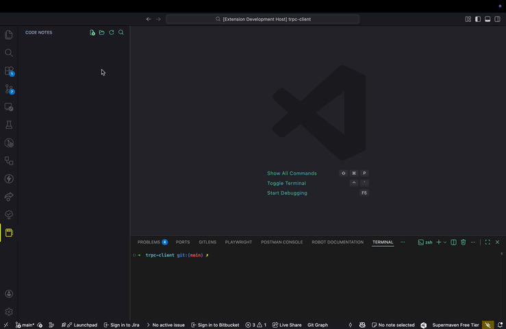

# Codebase Notebook 📝

Codebase Notebook is a VS Code extension that lets you take structured notes across your codebase and quickly jump between code and the notes that describe it.

## ✨ Features

### 📂 Notes Sidebar View

- Browse all notes

- Open, preview, and delete notes

- Refresh with one click

### 🧭 Code References

- Attach notes to specific files + line numbers

- Jump directly back to referenced code

- Works great for reviews, onboarding, debugging, refactoring

### ✍️ Simple Markdown Notes

- Notes are stored as readable Markdown

- Easy to version, sync, and share

- You own your notes (no database, no vendor lock)

### ⚡ Fast Navigation

- Open notes from the tree view

- Open associated code reference in one click

### 📸 UI Overview



- Activity Bar → Codebase Notebook

- Sidebar tree listing all your notes

- Commands available in the view header & context menu

## 🚀 Getting Started

### Installation

Install from VS Code Marketplace (coming soon)
or

Clone the repo & run:

```bash
npm install
npm run watch
```

Then press F5 to launch the extension dev host.

## 🎯 Core Commands

| Command                                   | Description                                     |
| ----------------------------------------- | ----------------------------------------------- |
| `Codebase Notebook: Create Note`          | Create a new note                               |
| `Codebase Notebook: Select Note`          | Switch the active note                          |
| `Codebase Notebook: Add Reference`        | Attach a code reference to a note               |
| `Codebase Notebook: Go to Reference`      | Jump to referenced file + line                  |
| `Codebase Notebook: View Note`            | Open preview of current note                    |
| `Codebase Notebook: Open Notes Directory` | Open storage folder for notes                   |
| `Codebase Notebook: Delete Note`          | Remove note                                     |
| `Codebase Notebook: Refresh Tree`         | Reload notes list                               |
| `Codebase Notebook: Open Note from Tree`  | Open by clicking tree item                      |
| `Codebase Notebook: View Note at`         | View note related to current cursor (if exists) |

You’ll find most actions in:

- Command Palette (Cmd/Ctrl + Shift + P)
- Codebase Notebook sidebar
- Tree item right-click menus

## 🗂️ Where are notes stored?

Notes are stored locally in a Markdown directory (managed by the extension).

They’re human readable and version-control friendly.

If you have ideas or feature requests, open an issue!

## ❤️ Sponsor

If this helps your workflow, consider sponsoring:
👉 https://github.com/sponsors/kyonru

## 🏷️ License

MIT — feel free to hack, extend, and share.
